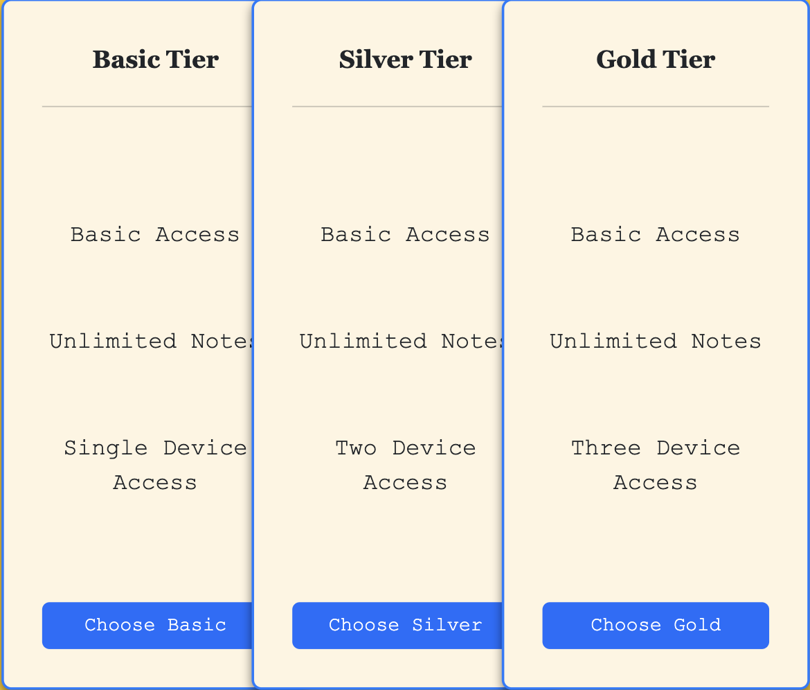

# notes-app - Nimbus

## Index
- Overview
- Features
- Getting Started
- Running the Application
- Usage
-Pricing
- Project Structure
- Dependencies
- Problems Encountered and Learning Process
-[Link to Google Doc ](https://docs.google.com/document/d/10j_aNiKK_E2lYpR9dw4mWMepIsMjgLnv5hprBdDbW9o/edit?usp=sharing)
## Overview
Nimbus is a note-taking app built using Node.js,Express,Mongoose and Atlas. It features Local,Google and Github authentication, basic CRUD operations and is styled with bootstrap. Oh you can also share your notes with your friend and collaborate in realtime. 

## Features
- **User Authentication**: Sign up via local passport or sign in via google and github. 
- **Realtime Collaboration**: Share note with multiple users and collaborate together.  
- **User-friendly Interface**: Simple and straightforward UI with option to turn on dark mode. 
- **Confirmation Modals**: Custom modals for confirmation from sweetalerts library. 

## Getting Started
Follow these steps to set up and run the application:

1. **Clone the repository:**
   ```bash
    git clone git@github.com:kclim1/notes-app.git
    ```
2. **Navigate to root:**
    ```bash
    cd notes-app
    ```
3. **Install dependencies:**
    ```bash
    npm i 
    ```
4. **Set up .env keys if needed**
    ```bash
    GOOGLE_CLIENT_ID = your_ID
    GOOGLE_SECRET = google_secret
    GOOGLE_URI = your_google_URI
    SECRET  = your_secret 
    GITHUB_CLIENT_ID = your_github_id
    GITHUB_SECRET = your_github_secret
    MONGODB_URI = = your_mongodb_uri
    ```
5. **Run App:**
    ```bash
    npm start 
    ```
6. http://localhost:3000 will direct you to the index page. 

## Usage
To try out the realtime collaboration and the CRUD features of this app, I suggest you create at least 2 accounts. Then login to those accounts via 2 separate browsers. **I highly suggest using incognito.** Create a note from either account. The note cannot be shared until after it has been created. Then click "View Note" and you'll see a share button on the bottom right of the text area. Now simply add in a valid email. Once it's shared, you may need to refresh your dashboard for the note to appear. Once it does, feel free to place them side by side and start typing away to collaborate in realtime. Once you're done with that you can delete the note and it'll be removed from both users' dashboard. **Note that you have to create a note first before you can share**Each page will have a maximum of 12 notes and once the 13th note is created the 2nd page will appear in the pagination bar below. 

## Pricing

Nimbus is free to use for now ! 

## Project Structure
```bash
notes-app
├── public
│   ├── css
│   │   ├── dashboard.css
│   │   ├── notepad.css
│   │   └── styles.css
│   └── img
│       ├── note.svg
│       ├── shrug.svg
│       └── wrong.svg
├── server
│   ├── config
│   │   ├── db.js
│   │   ├── notes.js
│   │   └── user.js
│   ├── controllers
│   │   ├── dashboardControllers.js
│   │   └── mainController.js
│   └── routes
│       ├── auth.js
│       └── index.js
├── views
│   ├── layouts
│   │   ├── dashboard.ejs
│   │   └── main.ejs
│   ├── partials
│   │   ├── footer_dashboard.ejs
│   │   ├── footer.ejs
│   │   ├── header_dashboard.ejs
│   │   └── header.ejs
│   ├── dashboard.ejs
│   ├── editNote.ejs
│   ├── index.ejs
│   ├── login.ejs
│   ├── page404.ejs
│   ├── pricing.ejs
│   ├── reviews.ejs
│   └── signup.ejs
├── .gitignore
├── app.js
├── README.md
├── package.json
└── package-lock.json
```

### Dependencies

- **bcryptjs**  
  **Description:** A library to help you hash passwords.  
  **Installation:**  
  ```bash
  npm install bcryptjs
  ```
- **connect-mongo**  
  **Description:** A MongoDB session store for Express that allows sessions to be stored in a MongoDB database.  
  **Installation:**  
  ```bash
  npm install connect-mongo
- **crypto**  
  **Description:** A built-in Node.js module for cryptographic functionality, including creating hashes and generating random values.  
  **Installation:** Comes pre-installed with Node.js, no separate installation needed.

- **dotenv**  
  **Description:** Loads environment variables from a `.env` file into `process.env`. This is used to manage sensitive information such as database URIs and session secrets.  
  **Installation:**  
  ```bash
  npm install dotenv
    ```
- **ejs**  
  **Description:** Embedded JavaScript templates that let you generate HTML markup with plain JavaScript.  
  **Installation:**  
  ```bash
  npm install ejs
    ```
- **express**  
  **Description:** A minimal and flexible Node.js web application framework that provides a robust set of features for web and mobile applications.  
  **Installation:**  
  ```bash
  npm install express
    ```
- **express-ejs-layouts**  
  **Description:** Layout support for Express.js applications that use the EJS template engine.  
  **Installation:**  
  ```bash
  npm install express-ejs-layouts
    ```
- **express-session**  
  **Description:** A session middleware for Express that helps in managing user sessions with support for various session stores.  
  **Installation:**  
  ```bash
  npm install express-session
    ```
- **express-validator**  
  **Description:** A set of express.js middlewares that wraps validator.js for data validation and sanitization.  
  **Installation:**  
  ```bash
  npm install express-validator
    ```
- **method-override**  
  **Description:** Middleware that allows you to use HTTP verbs such as PUT or DELETE in places where the client doesn't support it.  
  **Installation:**  
  ```bash
  npm install method-override
    ```
- **mongoose**  
  **Description:** An ODM (Object Data Modeling) library for MongoDB and Node.js. It provides a straightforward API for interacting with MongoDB, including schema validation and model management.  
  **Installation:**  
  ```bash
  npm install mongoose
    ```
- **passport**  
  **Description:** A middleware for Node.js that simplifies user authentication by providing various strategies for different authentication methods.  
  **Installation:**  
  ```bash
  npm install passport
    ```
- **passport-github2**  
  **Description:** A Passport strategy for authenticating with GitHub using OAuth 2.0.  
  **Installation:**  
  ```bash
  npm install passport-github2
    ```
- **passport-google-oauth20**  
  **Description:** A Passport strategy for authenticating with Google using OAuth 2.0.  
  **Installation:**  
  ```bash
  npm install passport-google-oauth20
    ```
- **passport-local**  
  **Description:** A Passport strategy for authenticating with a username and password.  
  **Installation:**  
  ```bash
  npm install passport-local
    ```
- **socket.io**  
  **Description:** A JavaScript library for real-time, bidirectional communication between web clients and servers.  
  **Installation:**  
  ```bash
  npm install socket.io
    ```
- **socket.io-client**  
  **Description:** The client-side library for connecting to a Socket.IO server for real-time communication.  
  **Installation:**  
  ```bash
  npm install socket.io-client
    ```
- **nodemon**  
  **Description:** A development tool that automatically restarts the Node.js server when file changes in the directory are detected.  
  **Installation:**  
  ```bash
  npm install nodemon --save-dev
    ```
- **Quill**  
  **Description:** A powerful, open-source rich text editor built for the web, which provides a WYSIWYG (What You See Is What You Get) editing experience. Quill is designed to be customizable and extendable, making it easy to integrate into any web application for creating and editing content.  
  **Installation:**  
  ```bash
  npm install quill
    ```

## API endpoints
### Index routes


**Home Page**

   **Endpoint:** `GET ('/)`

   **Description:** Renders the homepage of the application.

   **Response:**
   - **200 OK:** Returns the HTML content of the homepage.
   - **500 Internal Server Error:** Returns an error message if there is an issue rendering the homepage.
---
**Pricing Page**

   **Endpoint:** `GET ('/pricing')`

   **Description:** Renders the pricing information page for the application.

   **Response:**
   - **200 OK:** Returns the HTML content of the pricing page.
   - **Error** Renders page404 which just says "Something went wrong". The real errors are console.logged and handled in a try catch block. 
---
**404 Not Found**

   **Endpoint:** `GET *`

   **Description:** Handles all other routes that are not defined. This is a catch-all route for invalid URLs and displays a 404 error page.

   **Response:**
   - **404 Not Found:** Renders the 404page.
   ---
   **Login Page**

   **Endpoint:** `GET /login`

   **Description:** Renders the login page for users to enter their credentials and authenticate.

   **Response:**
   - **200 OK:** Returns the HTML content of the login page.
   - **500 Internal Server Error:** Returns an error message if there is an issue rendering the login page.
   ---
   **User Login**

   **Endpoint:** `POST /log-in`

   **Description:** Authenticates a user by checking the provided credentials and starts a session if successful. Uses local strategy. 

   **Request Body:**
   ```json
   {
     "username": "string",
     "password": "string"
   }
   ```
   ---
   **User Logout**

   **Endpoint:** `GET /log-out`

   **Description:** Logs out the currently authenticated user and ends their session.

   **Response:**
   - **302 Found:** Redirects to `/` homepage after a successful logout.
   ---
   **Dashboard**

   **Endpoint:** `GET /dashboard`

   **Description:** Renders the main dashboard page for authenticated users. 

   **Middleware:** `ensureAuthenticated`

   **Response:**
   - **200 OK:** Returns the HTML content of the dashboard page.
   - **401 Unauthorized:** Redirects user to login page
   - **500 Internal Server Error:** Returns an error message if there is an issue rendering the dashboard page.
   ---
 **View All Notes**

   **Endpoint:** `GET /dashboard/notes`

   **Description:** Retrieves and displays a list of all notes for the authenticated user on the dashboard.

   **Middleware:** `ensureAuthenticated`

   **Response:**
   - **200 OK:** Renders users notes on the dashboard. 
   - **401 Unauthorized:** Redirects to login page
   - **500 Internal Server Error:** Returns an error message if there is an issue retrieving or rendering the notes.
   ---
   **Add New Note Page**

**Endpoint:** `GET /dashboard/note/add`

**Description:** Renders the page where authenticated users can create a new note.

**Middleware:** `ensureAuthenticated`

**Response:**
- **200 OK:** Returns the HTML content of the add new note page.
- **401 Unauthorized:** Redirects users to the login page.
- **500 Internal Server Error:** Returns an error message if there is an issue rendering the add note page.

---

**Add New Note**

**Endpoint:** `POST /dashboard/note/add`

**Description:** Submits the form for creating a new note. Saves the note to the user's account.

**Middleware:** `ensureAuthenticated`

**Request Body:**
```json
{
  "title": "string",
  "content": "string"
}
```
---

   **View Specific Note**

**Endpoint:** `GET /dashboard/notes/:id`

**Description:** Retrieves and displays the details of a specific note identified by its `id`.

**Middleware:** `ensureAuthenticated`

**Request Parameters:**
- **id** (string): The unique identifier of the note to be retrieved.

**Response:**
- **200 OK:** Renders the HTML content of the specific note.
- **401 Unauthorized:** Redirects users to the login page if they are not authenticated.
- **404 Not Found:** Returns an error message if the note with the specified `id` does not exist.
- **500 Internal Server Error:** Returns an error message if there is an issue retrieving or rendering the note.

---

**Update Note**

**Endpoint:** `POST /dashboard/notes/:id`

**Description:** Updates the details of a specific note identified by its `id` with the provided data.

**Middleware:** `ensureAuthenticated`

**Request Parameters:**
- **id** (string): The unique identifier of the note to be updated.

**Request Body:**
```json
{
  "title": "string",
  "content": "string"
}
```


## Known Issues

- Real-time collaboration may experience slight lag in low-bandwidth conditions. 
- Errors may occur if logged into two accounts using same browser. Sometimes even a separate browser. It's best to use one in incognito and the other regular. 
- Dark mode toggle may not persist on page reload.
-Github auth may not return user's email in response depending on your privacy settings. Best to test with local and google auth. 

## List of Key Technologies Used

- **Node.js**: JavaScript runtime built on Chrome's V8 JavaScript engine.
- **Express.js**: A minimal and flexible Node.js web application framework.
- **MongoDB**: A NoSQL database for storing user data and notes.
- **Mongoose**: An ODM (Object Data Modeling) library for MongoDB and Node.js.
- **Passport.js**: Middleware for user authentication supporting various strategies, including local, Google, and GitHub.
- **Socket.io**: A JavaScript library for real-time, bidirectional communication between web clients and servers.
- **Bootstrap**: A popular CSS framework for responsive design and styling.
- **SweetAlert**: A library for creating beautiful, customizable, and responsive modals.
- **MongoDB Atlas**: Managed cloud database service for secure, scalable, and high-performance MongoDB hosting.


